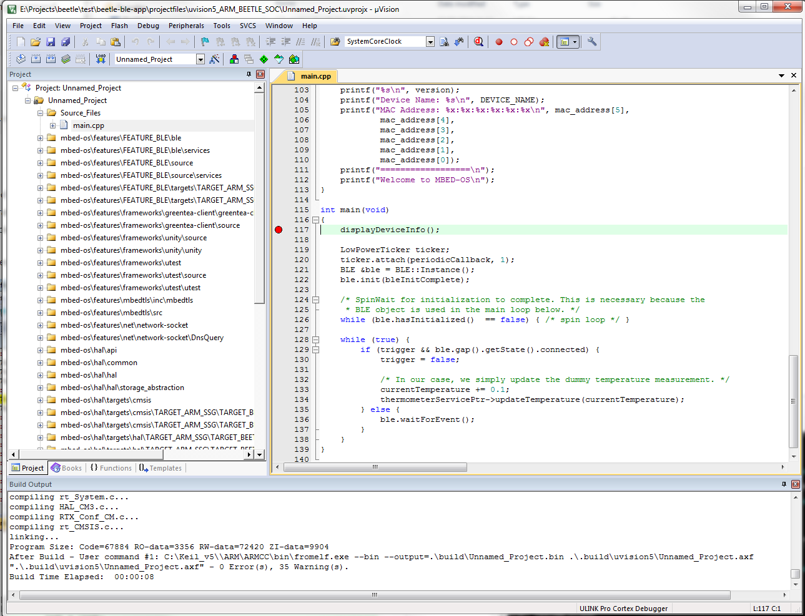

Beetle BLE Demo Application
===========================

This repository contains a demo BLE Application meant to demonstrate the BLE capabilities of the ARM Beetle SoC in mbed environment.
The application is compliant with mbed-os and mbed classic.

Buid procedure
--------------

* Setup the mbed environment. For all the information refer to [mbed](https://developer.mbed.org/).
* Install mbed-cli (requires python >= 2.7.11):
```
> pip install mbed-cli
```
* Verify that mbed-cli version is at least 0.8.9:
```
> mbed --version
```
* Clone this repository:
```
> git clone https://github.com/ARMmbed/beetle-ble-app.git
```
* Enter into beetle-ble-app:
```
> cd beetle-ble-app
```
* Update and Sync mbed-os:
```
> mbed update
> mbed sync
```
* Install mbed-os core dependencies:
```
> pip install -r mbed-os/requirements.txt
```
* Go back to beetle-ble-app directory and compile the application:
```
* GCC_ARM:
> mbed compile -m ARM_BEETLE_SOC -t GCC_ARM
* ARMCC:
> mbed compile -m ARM_BEETLE_SOC -t ARM
```
* The generated application will be in .build/ARM_BEETLE_SOC/compiler-name/beetle-ble-app.bin

Flash Procedure and Testing
---------------------------

* For the flashing procedure and the Serial port configuration please refer to [Beetle mbed Instructions](https://community.arm.com/docs/DOC-11614).
* After completing the procedure you should be able to visualize on the serial port a message like:
```
ARM SSG BEETLE.SYSTEM.CORE.2.0.1.0 Jul 19 2016 17:35:15
Device Name: Beetle-IoT-TS
MAC Address: 01:23:45:67:89:01
==================
Welcome to MBED-OS
```
* At this point you should be able to connect to the beetle device using a Bluetooth enabled device.
In our test we used an Android tablet and the application: [nRF Master Control Panel](https://play.google.com/store/apps/details?id=no.nordicsemi.android.mcp&hl=it).


Export the Beetle BLE project to Keil MDK
-----------------------------------------

* From the command line, run the following command:
```
> mbed export -m ARM_BEETLE_SOC -i uvision5
```

* You should see the following output:
```
Successful:
  * ARM_BEETLE_SOC::uvision5    .\projectfiles\uvision5_ARM_BEETLE_SOC\Unnamed_Project
```

* The project files are contained into the directory: .\projectfiles\uvision5_ARM_BEETLE_SOC


